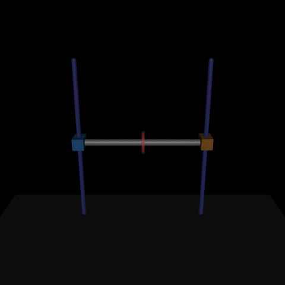

# Serpentine RL Agent – Dual-Rail Ring Balance

This repository hosts a custom MuJoCo environment and PPO training harness where two vertically actuated carts hold a passive grey crossbar. A free-moving ring rides on that bar; the learning agent controls the left cart while the right cart follows a scripted sinusoid. The objective is to keep the ring centred for as long as possible.

## Environment Overview

- **Engine:** MuJoCo (`gymnasium` bindings)  
- **Actuators:** one trainable motor on the left cart and a scripted sinusoid driving the right cart  
- **Passive mechanics:** rigid grey crossbar connecting both carts and a passive ring constrained to slide along the bar  
- **Observation (12 values):** left/right rail heights & velocities, crossbar height & vertical velocity, height difference, bar tilt (`z`-axis component), bar pitch rate, ring displacement & velocity, plus the sinusoidal partner command  
- **Action (1 value):** continuous motor command in `[-1, 1]` for the left rail motor (the right rail is driven by a sine wave)  
- **Reward:** starts at `1.0` per step and subtracts penalties for ring displacement, rail mismatch, bar tilt, crossbar height error, velocity energy, motor effort, and control disagreement. Episodes terminate when the ring nears the end stops, the bar tilts too far from horizontal, or the crossbar leaves its safe vertical band.

The MuJoCo model lives in `serpentine_rl/envs/assets/horizontal_coop_pendulum.xml`. It builds twin vertical rails linked by an equality-constrained crossbar and adds a sliding “ring” carriage that must be balanced near the centre while the partner rail oscillates.

## Getting Started

```bash
# (Optional) create a fresh virtual environment
python3 -m venv .venv
source .venv/bin/activate

pip install --upgrade pip
pip install -r requirements.txt
```

### Train the cooperative agent

```bash
PYTHONPATH=. python scripts/train_horizontal_pendulum.py \
    --total-timesteps 200000 \
    --log-dir runs/horizontal_pendulum
```

The script logs TensorBoard summaries and checkpoints to `runs/<timestamp>/`. Use `--render-eval` to watch evaluation rollouts during training. Episodes are capped at 1,000 steps by the `TimeLimit` wrapper.

## Sample Rollout



### Reward shaping

The step reward is `1.01` minus a bundle of quadratic penalties:

- ring displacement relative to the centre (`ring_weight * (ring_disp - target)^2`)
- twin penalties for height mismatch and bar tilt (`tilt_weight * (rail_delta^2 + axis_z^2)`)
- crossbar height error versus its nominal resting height
- kinetic energy proxies for the ring, crossbar pitch/vertical velocity, and rail velocities
- mild `L2` control effort plus a cooperation penalty on the difference between the learned action and the scripted partner drive

Episodes end early if the ring approaches the limits, the bar tips beyond `max_tilt`, or the crossbar moves outside `[0.08, 1.4]` m.

### Evaluate a trained policy

```bash
PYTHONPATH=. python scripts/evaluate_horizontal_pendulum.py \
    --model-path runs/horizontal_pendulum/horizontal_pendulum_ppo.zip \
    --episodes 3 --deterministic --sleep 0.02
```
